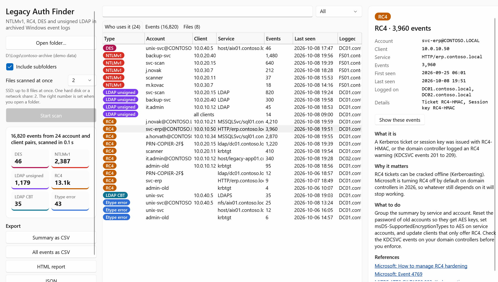
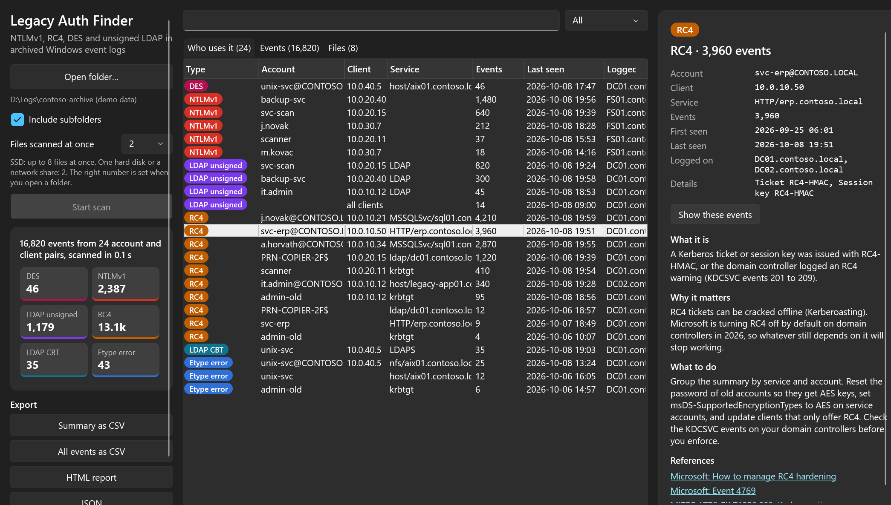
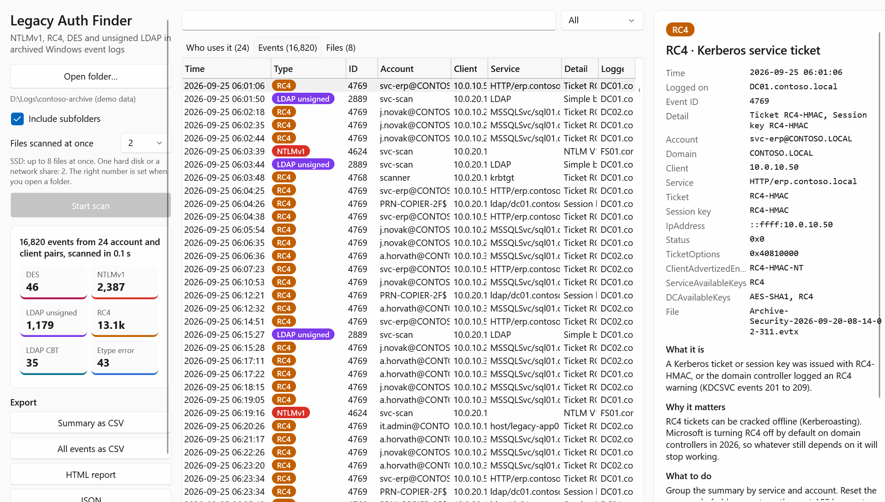
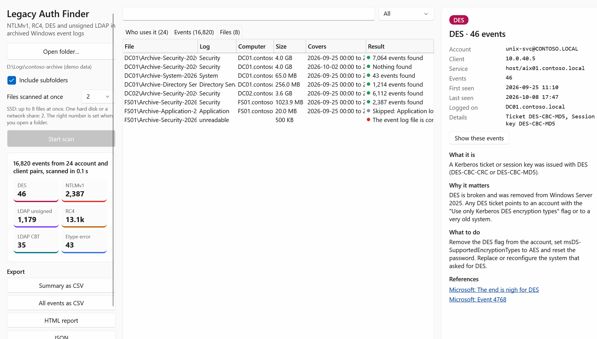

# Legacy Auth Finder


Legacy Auth Finder finds **NTLMv1, RC4, DES and unsigned LDAP** in archived Windows event logs, plus the Kerberos requests that already fail for lack of a common encryption type. Point it at a folder of `.evtx` files copied from your servers and domain controllers. It works out which log each file is, then scans the Security, System and Directory Service logs when you press Start scan. It shows who still uses the old protocols, and you can search the results and export them. Files of 4 GB and more are fine.



<details>
<summary>Dark theme, event list and file list</summary>






</details>

The screenshots show the built-in demo data for a made-up domain.

## Why

Microsoft is turning off RC4 for Kerberos on domain controllers in 2026. NTLMv1 and DES should have been gone years ago. Before you enforce anything, you need to know what still depends on them, and the answer is usually buried in gigabytes of archived Security logs. Typical problems:

- Event Viewer struggles with multi-gigabyte archives, and you would need a separate filter for every file.
- PowerShell `Get-WinEvent` works, but you have to write the filters, the parsing and the grouping yourself.
- The useful answer is not a list of events. It is a list of accounts, clients and services to fix.

Legacy Auth Finder does all of that in one pass and gives you that list.

## What it finds

| Type | Where | How it is recognized |
|---|---|---|
| NTLMv1 and LM | Security log, events 4624 and 4625 (any server) | `LmPackageName` is `NTLM V1` or `LM` |
| RC4 | Security log, events 4768, 4769, 4770 (domain controllers) | `TicketEncryptionType` or `SessionKeyEncryptionType` is `0x17` or `0x18` |
| DES | Security log, events 4768, 4769, 4770 (domain controllers) | `TicketEncryptionType` or `SessionKeyEncryptionType` is `0x1` or `0x3` |
| RC4 warnings | System log, KDCSVC events 201 to 209 (domain controllers) | Added by Microsoft in 2026 for the RC4 phase-out |
| Unsigned LDAP | Directory Service log, events 2889 and 2887 (domain controllers) | 2889 names the client, the account and the bind type: SASL without signing or a simple bind with a cleartext password. 2887 is the daily count. |
| LDAP channel binding | Directory Service log, events 3039, 3074, 3075 | Clients that connect over LDAPS without a valid channel binding token |
| Encryption type errors | System log, KDC events 14, 16, 26, 27, and Security events 4768, 4769, 4771 with status `0xE` | Kerberos requests that failed because client, account and domain controller had no encryption type in common. These are what breaks when RC4 or DES is turned off. |

Newer domain controllers also log `ClientAdvertizedEncryptionTypes`, `ServiceAvailableKeys` and related fields in 4768 and 4769. The tool shows them in the detail pane. They tell you whether the client or the service account is the reason RC4 was used.

**Auditing must be on.**
- NTLMv1 shows up only when "Audit Logon" success is enabled on the server.
- RC4, DES and the `0xE` failures show up only when "Audit Kerberos Authentication Service" and "Audit Kerberos Service Ticket Operations" are enabled on the domain controllers (failure auditing for the `0xE` events).
- Event 2889 needs the "16 LDAP Interface Events" diagnostic value set to 2 on the domain controllers. Without it you only get the daily summary 2887, which tells you that unsigned binds happen but not who makes them.
- Channel binding events appear only when the domain controller's channel binding policy is set to "When supported" or "Always".

## How it works

1. **Inventory.** When you open a folder, every `.evtx` file in it and its subfolders is opened and its first record tells which log it belongs to. File names like `Archive-Security-...` are not trusted. Unreadable or damaged files are listed with the reason. Nothing is scanned yet, so you can check the file list first.
2. **Scan.** Press Start scan. Security, System and Directory Service logs are scanned with XPath filters that run inside the Windows event log API. A 4 GB file is streamed, never loaded into memory, and only matching records reach the tool. Reads come back every half second even when nothing matches, so Cancel stops within a second and each file shows how long it has been read.
3. **Files at once.** When you open a folder, the tool checks what kind of disk it is on and picks the number of files to scan in parallel: up to 8 on an SSD, 2 on a hard disk or a network share. You can change it, but on one hard disk more files at once make the disk seek between them and the whole scan slower.
4. **Results.**
   - **Who uses it** groups the events by type, account, client and service, with counts and first and last seen. This is your to-do list.
   - **Events** lists every single event and is searchable.
   - **Files** shows the detected log, the computer, the time range and the result of each file.

On an SSD the scan runs at roughly 100 MB per second per file, so a 4 GB archive takes well under a minute. A hard disk or a network share is slower and the number of files at once matters more than anything else. Very large results are handled too: the event list keeps the first 2 million events, and the summary and totals always count all of them.

## Searching

Type one or more words into the search box. A row matches when every word appears in the account, client, service, server, file or type. For example, `sql01 10.0.10.21` shows the RC4 tickets of one client for one SQL server. Double-click a summary row, or use "Show these events", to jump to its events. CSV exports contain exactly what you currently see.

## Download

Grab `LegacyAuthFinder-win-x64.zip` from the [latest release](https://github.com/JW-0042/win-legacy-auth-finder/releases/latest). It contains two self-contained executables, so no .NET install is needed:

| File | What it is |
|---|---|
| `LegacyAuthFinder.exe` | Desktop app (WPF, follows the Windows light or dark theme). You can drop a folder onto the window. |
| `legacy-auth-scan.exe` | Command line version for scripts and scheduled reports |

No admin rights are needed to read copied `.evtx` files. GitHub Actions builds every release and adds a signed build provenance attestation. See [SECURITY.md](SECURITY.md) for how to verify a download.

## Command line

```
legacy-auth-scan <folder> [--no-recurse] [--threads <n>] [--events-csv <file>] [--summary-csv <file>] [--json <file>] [--html <file>] [--quiet]
```

| Exit code | Meaning |
|---|---|
| 0 | Nothing found |
| 1 | NTLMv1, RC4 or DES found |
| 2 | Invalid arguments |
| 3 | No readable Security, System or Directory Service logs in the folder |

Example:

```
legacy-auth-scan \\fileserver\logs\2026-09 --summary-csv rc4-todo.csv --html report.html
```

## Build from source

You need the .NET 10 SDK on Windows.

```
dotnet build LegacyAuthFinder.slnx
dotnet test LegacyAuthFinder.slnx
dotnet run --project src/LegacyAuthFinder.App
```

## Project layout

```
src/LegacyAuthFinder.Core     file inventory, XPath queries, classification, summary, demo data, reports
src/LegacyAuthFinder.App      WPF desktop app (MVVM, Fluent theme)
src/LegacyAuthFinder.Cli      command line front end
tests/LegacyAuthFinder.Tests  unit tests plus integration tests against real exported logs
```

The tool reads files through one interface, `IEvtxReader`. The unit tests use a fake reader. The integration tests export the System log of the machine they run on, and on CI also the Security log, and read it through the real Windows API. The demo data runs through the real scanner and summary, only the file reading is simulated.

## How this was built

I designed and wrote this tool together with an AI coding agent (Claude Code), the same way as [Hardening Checker](https://github.com/JW-0042/win-hardening-checker) and [Event Triage](https://github.com/JW-0042/win-event-triage). The full story is in [docs/how-this-was-built.md](docs/how-this-was-built.md).

## Disclaimer

Event logs only show what was audited and kept. If auditing was off or the archives do not cover a full business cycle (month-end jobs, quarterly reports), something can still depend on RC4 or NTLMv1. Use the KDCSVC audit events and a test period before you enforce.

## Author

Jozef Walterstein, consultant for AI, automation and security. [walterstein.eu](https://walterstein.eu)

License: [MIT](LICENSE)
